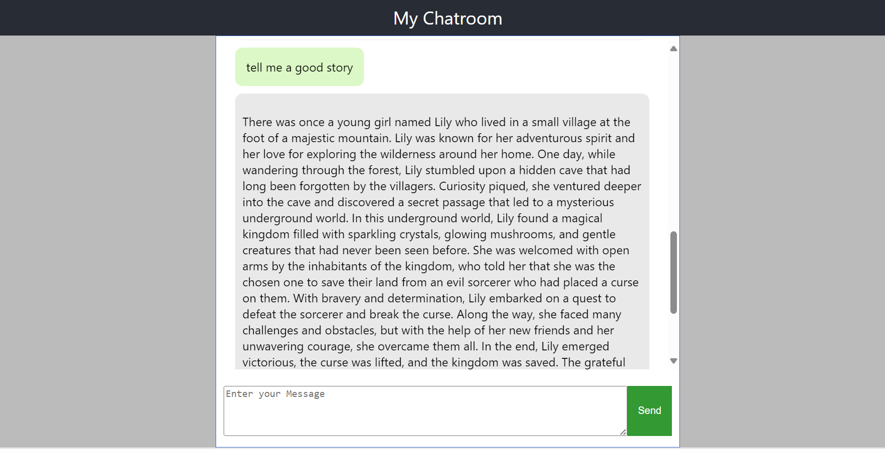

# ChatGPT Real-Time Chat Application



## About

This project integrates OpenAI's ChatGPT with a React.js application to create a real-time chat interface. It allows users to interact with ChatGPT in a conversational manner, making use of OpenAI's powerful language model.

## Features

- Real-time messaging
- Chat history
- Responsive design
- Integration with OpenAI's GPT-3.5 API

## Getting Started

### Prerequisites

- Node.js
- npm or yarn

### Installation

1. Clone the repository:

   ```bash
   git clone https://github.com/mike1011/chat-gpt.git
   cd chat-gpt
   ```

2. Install dependencies:

   ```bash
   npm install
   ```

3. Create a `.env` file in the root directory and add your OpenAI API key:

   ```plaintext
   REACT_APP_OPENAI_API_KEY=your_openai_api_key
   ```

### Running the Application

To start the development server:

```bash
npm start
```

Open [http://localhost:3000](http://localhost:3000) to view it in your browser.

### Building for Production

To build the app for production:

```bash
npm run build
```

This will create a `build` folder with the optimized production files.

## Contributing

1. Fork the repository.
2. Create a new branch (`git checkout -b feature-branch`).
3. Make your changes.
4. Commit your changes (`git commit -m 'Add some feature'`).
5. Push to the branch (`git push origin feature-branch`).
6. Open a pull request.

## License

This project is licensed under the MIT License. See the [LICENSE](LICENSE) file for details.

## Contact

For any inquiries or issues, please open an issue on the [GitHub repository](https://github.com/mike1011/chat-gpt/issues).

